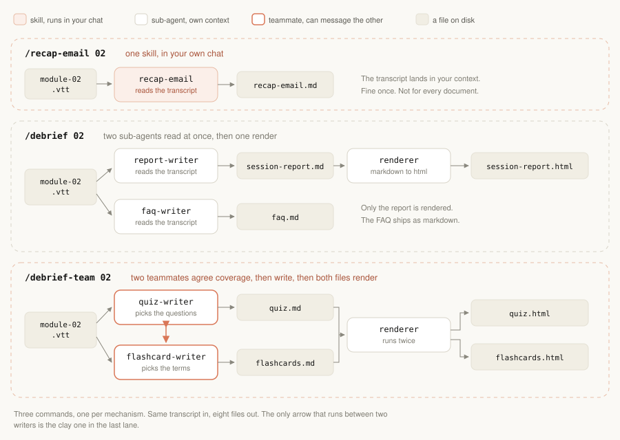
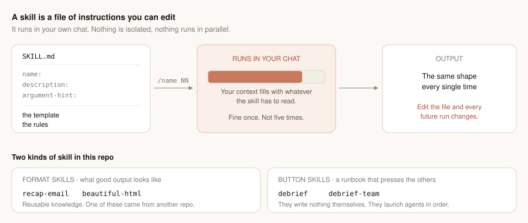
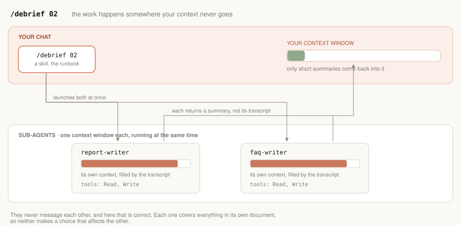
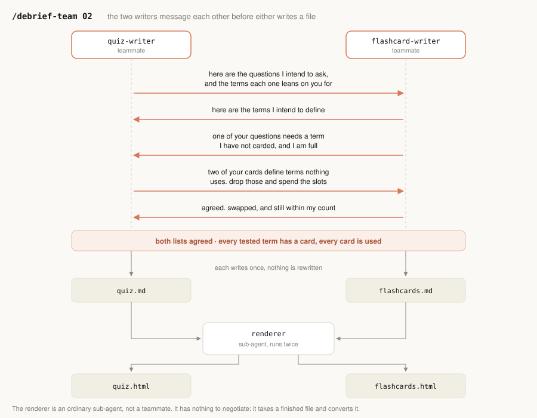

# Debrief: a guide to skills, sub-agents and agent teams

## Why we built this

Every week a course facilitator finishes a live class and has to ship the same five documents: a recap email, a session report, an FAQ, a quiz, and a set of flashcards. The raw material is a two-hour Zoom transcript, tens of thousands of tokens of speech-to-text with mishearings in it. The work is real, repetitive, and easy to do inconsistently.

Debrief turns that transcript into those five documents, plus HTML renders of three of them.

It is a working tool, and it is also a teaching repo. Building it honestly needs all three of the ways Claude Code shares work, and each one earns its place for a different reason. That is the point. You cannot learn when to reach for an agent team by reading a definition; you learn it by watching one problem grow until the simpler mechanism stops working.

Everything in `.claude/` is short. Nine markdown files, each one readable in a minute, plus one vendored HTML template that the renderer fills.

Three commands, one per mechanism. `/recap-email NN` writes the email. `/debrief NN` produces the session report and the FAQ. `/debrief-team NN` produces the quiz and the flashcards.

---

## Skills

**A skill is a file of instructions that Claude loads when it is relevant.** It has a name, a description telling Claude when to use it, and a body containing whatever you would otherwise have to explain every time: a template, a set of rules, a procedure. Typing `/name` runs it.

The important property is where it runs. **A skill runs in your own chat.** There is no separate context window and no parallelism. Whatever the skill has to read lands in front of you.

**The problem skills solve is inconsistency, not effort.** Writing a recap email is not hard. Writing it the same way every week, with the same subject line and the same closing lines, is the part people get wrong. Put the format in a file and that stops being a discipline problem.

**How they are used here.**

- `recap-email` holds the template and the rules for the weekly email. Change the subject line in that one file and every future email changes, with nothing else touched. That is the property worth showing a product manager: the format lives somewhere you can edit without writing code.
- `beautiful-html` is the same idea for turning markdown into a styled page. It came from someone else's repo, was dropped in, and worked. Skills are portable.
- `debrief` and `debrief-team` are skills too, but of a different kind. They hold a procedure rather than a format, write nothing themselves, and exist to launch the agents in the right order.

**Try it.** Run `/recap-email NN`. The email comes out right because the format is in a file. Now look at your context meter: the transcript is sitting in your chat. That is fine once. It is the reason for the next section.

---

## Sub-agents

**A sub-agent is a worker with its own context window and its own tool list.** You define it in a file, give it a job, and it goes away, does the work, and returns a short summary. What it read to get there never enters your context.

**The problem sub-agents solve is context and waiting.** Several jobs each need to read something large. Done in your chat they fill your context and queue behind each other. Handed to sub-agents they run at the same time, each in its own window, and you get summaries back instead of source material.

**How they are used here.** The session report and the FAQ each need the whole transcript. The report covers every topic in order; the FAQ covers every student question. Both are *exhaustive*: they leave nothing out, so neither one makes a choice that affects the other. They simply need to read a lot. That is exactly the shape sub-agents fit.

The `renderer` is a third sub-agent and a different kind of example: it is a worker that uses a skill. `beautiful-html` is the knowledge, the agent is the thing that applies it in its own context. It is not in the diagram above, which shows only the two writers, but you can see where it sits in the pipeline diagram at the top.

**Two more things the agent files control**, both visible in `.claude/agents/`:

- `tools:` restricts what the agent can do. Writers have Read and Write and nothing else, and that boundary is enforced by the harness rather than by asking the agent politely.
- `model:` picks the model per job. The flashcard writer runs on a smaller one because its job is the simplest.

**Try it.** Run `/debrief NN`. Two writers read the transcript at the same time and your chat stays clean. With the recap from the previous step, you now have three of the five documents. The two that are missing are the two that cannot be written independently.

---

## Agent teams

**A team is several agents that can message each other while they work.** Each teammate is a full session with its own context, they share a task list, and they can talk directly rather than reporting back to you and waiting to be told what to do next. It is experimental, and it costs noticeably more, because every teammate is a whole session rather than a summary.

**The problem teams solve is a gap that no single agent can see.** Not volume, and not speed. Coordination: one agent's choice constrains another's, and neither can know the other's choice in advance.

**How it is used here.** The quiz and the flashcards look like two documents and are really one study artifact. The quiz picks a handful of questions; the flashcards pick a handful of terms; a student uses both together. If the quiz tests a term the cards never define, someone who memorised every card still fails the quiz.

Neither writer can prevent that alone. The information each one needs is sitting in the other's head at the moment it is needed.

So they work under two rules, and neither rule can be checked by one agent:

- If the quiz tests a term, a card defines it.
- If a card defines a term, something uses it.

**Why not just have the main chat fix it?** It could compare the two finished files and spot the mismatch. But to decide *which* document should change, it would have to read the transcript and both drafts, and at that point it is doing the writing rather than coordinating it. The two writers each hold their own constraints, so they settle it in one exchange.

**Try it.** Run `/debrief-team NN`. Watch the two post their lists, find the gap, and trade slots. Then check the result: every term the quiz tests has a card behind it.

Agent teams read their flag at startup, so start that session with `CLAUDE_CODE_EXPERIMENTAL_AGENT_TEAMS=1` already set. It is in `.claude/settings.json`.

---

## The question that decides everything

Before reaching for a mechanism, work out which problem you actually have.

| If the problem is | Reach for | Because |
|---|---|---|
| The same work done the same way every time | **A skill** | The cost is inconsistency, not effort |
| Several jobs that each need a lot of context and do not affect each other | **Sub-agents** | The cost is context and waiting |
| One agent's choice constrains another's | **A team** | The cost is a gap neither can see alone |

**The trap is the middle and the right.** Work that merely *looks* interdependent usually is not, and a team is the most expensive thing in the list.

The recap email is the check on this. It too picks a subset, a handful of bullets from a long list of topics, so on the surface it looks like it belongs with the quiz and the flashcards. It does not. Nobody else's choices depend on which bullets it picks, and its choices depend on nobody else's. It reads the transcript and writes. That is a skill, and making it anything more would be paying for coordination that never happens.

**Ask who has to change their work because of yours.** If the answer is nobody, you do not need a team. Telling that apart from a real dependency is the hard part, and it is worth more than knowing any of the syntax.

---

## Reusing this for your own course

Edit the "This course" section of `CLAUDE.md`: the course name, the instructors, and where questions and resources come from. Everything above that section, and every file in `.claude/`, stays exactly as it is.

Then drop `module-N.vtt` into `transcript/` and run the three commands.